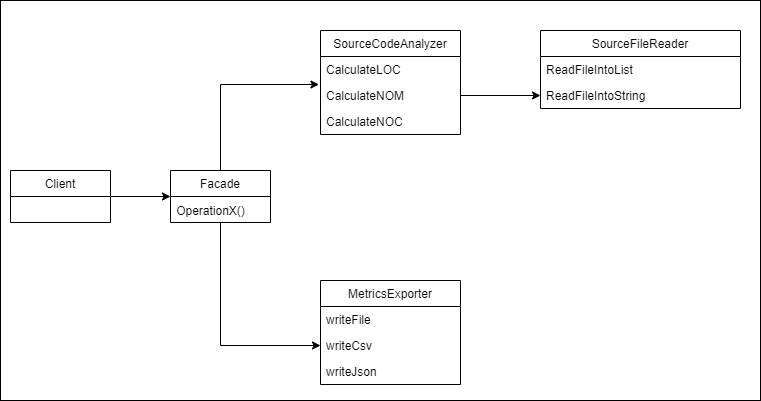

Lab Exercise 4 Design Patterns
---

The system is poorly designed and it requires major refactoring .
Said refactoring is executed with the Strategy and Factor Patterns in mind each to achieve different goals.

Facade Pattern
-
* We design the system to be used like a library .
* Multi-Step Process Access  , Read Source Code -Analyze It – Export Metrics Produced 
* Define the Entry Point for each sub-system/Step of the process . 
* SourceFileReader creates a String or a List that is the entry point of the SourceCodeAnalyzer that creates the metrics(int) that is the entry point of the Metrics exporter . 
 

Modified Class Diagram 
- 
